# Homework-3
## Preface
### Steps to re-produce
1. Install ZoKrates plugin to REMIX IDE.
2. Click creating example link. This will give you a program that generate a proof to show that a prover knows the square root of the given number.
   ```cairo
    def main(private field a, field b) {
        assert(a * a == b);
        return;
    }
   ```
3. Compile given sample code.
    <details close>
    <summary>Expand</summary>
    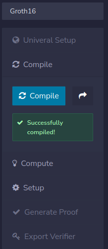
    </details>
4. Compute step.
    <details close>
    <summary>Expand</summary>
    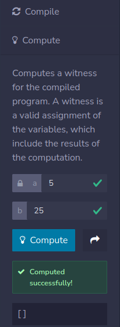
    </details>

5. Create setup (this will create a verification key). This will be in a file called `verification_key.json`.
    <details close>
    <summary>Expand</summary>
    Image of successful setup <br>
    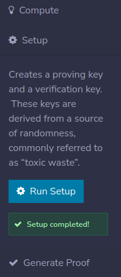
    </details>

6. Generate a proof for it. This will generate zero knowledge proof which will be given to the prover in a file called `proof.json`.
    <details close>
    <summary>Expand</summary>
    Image of successful Proof Generation <br>
    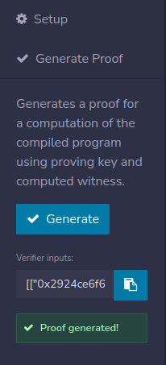
    </details>

7. Export verifier. This generates a Solidity contract named as `verifier.sol` which contains the generated verification key and a public function to verify a solution to the compiled program.
    <details close>
    <summary>Expand</summary>
    Image of successful Verifier Export <br>
    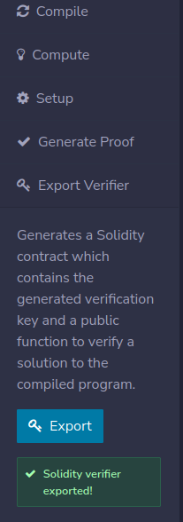
    </details>

8. Add licensing identifier (`SPDX-License-Identifier: MIT`) to `verifier.sol`, and then compile and deploy it.
    <details close>
    <summary>Expand</summary>
    Image of successful Contract Compilation <br>
    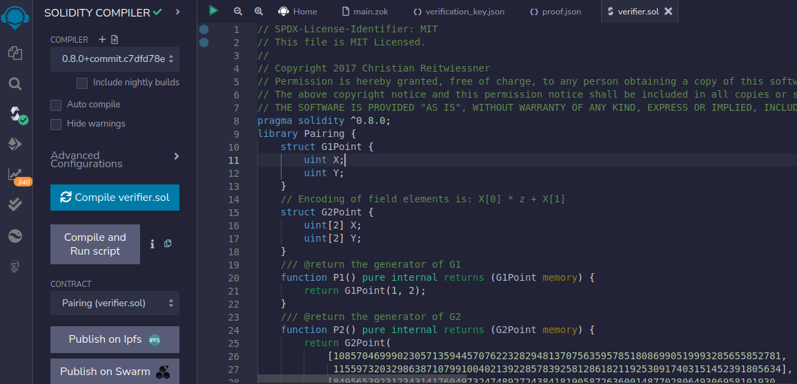 <br>
    Image of successful Contract Deployment <br>
    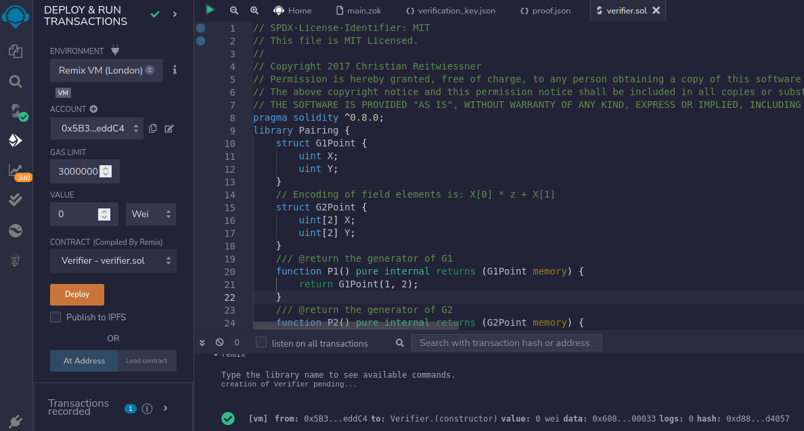
    </details>

## Homework
### Q1: Create a valid proof
During the setup process, we generated a proof in step 6.

```json
[["0x028a0650f13f9bec82a7d1c321be2fc3784e207f7115ba0caf1ac28463e6a240","0x28c88c98e6f3c9b1dc0e2edb39573d9a0d42ef5aadffedcada4ffe0dfb89249c"],[["0x088945e754dec4bffc5b28063aefa6922d183f76859573784c3b8ed51f03c07f","0x1b06a16b7fd0c74739b154dce3d7fe04a4689b5e1ea67a455379b5f4b0ccdfcb"],["0x09e1a0884bef47024539e40f01f9bc621366f814bf3d7c581d13d48e726fcbce","0x1fcaee6720f5bb85ad47086cdb0f0e389b012fb464c1f7376595ca3b6a444a47"]],["0x03e1863d6163e44654b5407301ce66b6848bb14d93729eeb8601924ef2163cb7","0x1890c8f1e5c38f8ec77801d84c253f483df1ca15e964a318da39efca45d787a6"]],["0x0000000000000000000000000000000000000000000000000000000000000019"]
```

It was also given inside `proof.json` file.
<details close>
<summary>Expand</summary>

```json
{
  "scheme": "g16",
  "curve": "bn128",
  "proof": {
    "a": [
      "0x028a0650f13f9bec82a7d1c321be2fc3784e207f7115ba0caf1ac28463e6a240",
      "0x28c88c98e6f3c9b1dc0e2edb39573d9a0d42ef5aadffedcada4ffe0dfb89249c"
    ],
    "b": [
      [
        "0x088945e754dec4bffc5b28063aefa6922d183f76859573784c3b8ed51f03c07f",
        "0x1b06a16b7fd0c74739b154dce3d7fe04a4689b5e1ea67a455379b5f4b0ccdfcb"
      ],
      [
        "0x09e1a0884bef47024539e40f01f9bc621366f814bf3d7c581d13d48e726fcbce",
        "0x1fcaee6720f5bb85ad47086cdb0f0e389b012fb464c1f7376595ca3b6a444a47"
      ]
    ],
    "c": [
      "0x03e1863d6163e44654b5407301ce66b6848bb14d93729eeb8601924ef2163cb7",
      "0x1890c8f1e5c38f8ec77801d84c253f483df1ca15e964a318da39efca45d787a6"
    ]
  },
  "inputs": [
    "0x0000000000000000000000000000000000000000000000000000000000000019"
  ]
}
```
</details> <br>

If proof was accepted you will see `true` under the `verifyTx` function.

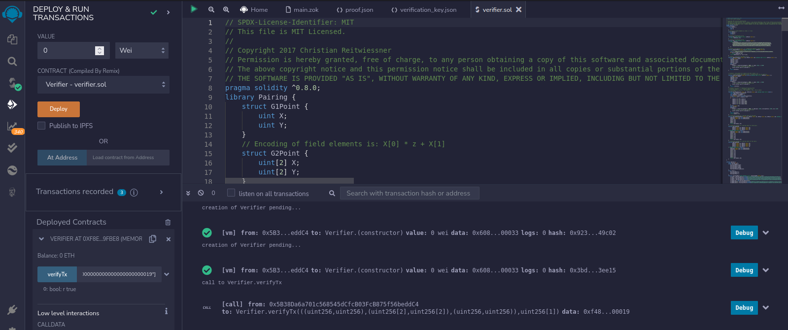

### Q2: Create an invalid proof
For this one go back to generated proof and change just a one number.
```json
[["0x028a0650f13f9bec82a7d1c321be2fc3784e207f7115ba0caf1ac28463e6a240","0x28c88c98e6f3c9b1dc0e2edb39573d9a0d42ef5aadffedcada4ffe0dfb89249c"],[["0x088945e754dec4bffc5b28063aefa6922d183f76859573784c3b8ed51f03c07f","0x1b06a16b7fd0c74739b154dce3d7fe04a4689b5e1ea67a455379b5f4b0ccdfcb"],["0x09e1a0884bef47024539e40f01f9bc621366f814bf3d7c581d13d48e726fcbce","0x1fcaee6720f5bb85ad47086cdb0f0e389b012fb464c1f7376595ca3b6a444a47"]],["0x03e1863d6163e44654b5407301ce66b6848bb14d93729eeb8601924ef2163cb7","0x1890c8f1e5c38f8ec77801d84c253f483df1ca15e964a318da39efca45d787a6"]],["0x0000000000000000000000000000000000000000000000000000000000000018"]
```

When you retry `verifyTx` you will see that it will be rejected, namely return value will be `false` this time.

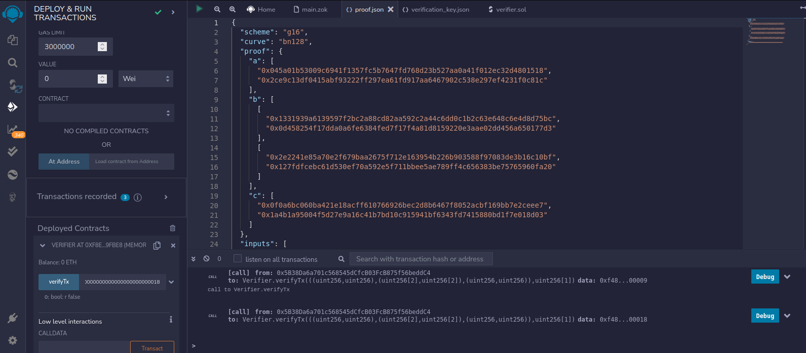

### [Q3: Another ZoKrates Prover](https://zokrates.github.io/examples/sha256example.html)
Repeat all the step in [preface part](#preface).

1. Content of `main.zok`
    <details close>
    <summary>Expand</summary>

    ```cairo
    import "hashes/sha256/512bitPacked" as sha256packed;

    def main(private field a, private field b, private field c, private field d) -> field[2] {
        field[2] h = sha256packed([a, b, c, d]);
        return h;
    }
    ```

    </details> <br>

2. Pass field parameters as 0, 0, 0 and 5 respectively because of obviously explained reason in the tutorial.
    <details close>
    <summary>Expand</summary>

    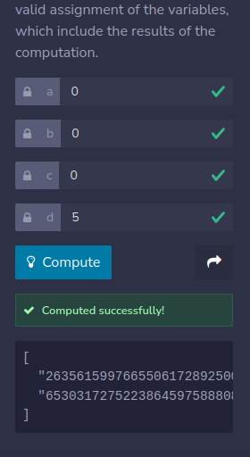

    </details>

    <details close>
    <summary>See the computation result</summary>

    ```json
    [
        "263561599766550617289250058199814760685",
        "65303172752238645975888084098459749904"
    ]
    ```

    </details>

3. Create setup.

    <details close>
    <summary>See the content of <code>verification_key.json</code> file</summary>

    ```json
    {
    "scheme": "g16",
    "curve": "bn128",
    "alpha": [
        "0x2c4903472c561c1c75803a1949bdd40caf4b6de5e42b60c3185bf3598874edda",
        "0x04642c8f9693c5410bad3c6d12211e1d2f6f80cd18158209faa59288b2d2557d"
    ],
    "beta": [
        [
        "0x021ac4bfb863a4f52e54bbc8baebb7ef0cb5d69a2bc0868ee5bb7771257ceab2",
        "0x2908534feb3d6942c69381466fc3081400f3ebd2ec372ab8335c919e0a371ca7"
        ],
        [
        "0x1f29cd241ad7f4e83cdec29006ea6fab1e1a352d015089e61ed29786987a5e1a",
        "0x12fc12a099c3394080b2032eb9333aa5fa89288843417ff5557903d1f46c95fe"
        ]
    ],
    "gamma": [
        [
        "0x1e51ca5038a2d260c515229e9befaaade06d6c2024468cd802f55c97ac2811ad",
        "0x1cf775bda9bdef3dd34b545ac32cd063e21c75c0a0ed09a6482af169b27183af"
        ],
        [
        "0x1ca1016f78c72f93cad2746964dd425ca29e94fe2ba73251bc11ab343c6acb3b",
        "0x15a12be5235a6997c126c1e825ddb1fba7341479086e565aa322f39792d89ac5"
        ]
    ],
    "delta": [
        [
        "0x2068e5b4346efa766178511485c39c5e423fd3d834b0a57f73ac9e01d1e51863",
        "0x2e8091a1bdc8216fe109aa9808b97f3f4fcfab0b5bee34d35712035aba378e3d"
        ],
        [
        "0x01be54772e3e4b30844fe251766e9b77eba6d580ccd5a13c79b2fb30c1520759",
        "0x1f2990165413a74843b85655fdd92a09fc9c2cb6e2793dd20968575ce1969196"
        ]
    ],
    "gamma_abc": [
        [
        "0x2cf503c99d5db1b4a8650c2784b223c1c7176f227c382d313818a985ea4d2438",
        "0x2bbf5d251b996c34a40d79be2c62fd55545aa6f9407250a386914307708c87f9"
        ],
        [
        "0x1dc15797a4f570533f829c448003d468e1a679ff2eb34a2a2b30e3f6dfc87473",
        "0x08224fbb7d1dfca680671eab5544ca1ab82ba0933bb0df9929bab3bc0f173f01"
        ],
        [
        "0x039f64b348f1a1bd42ac145b5611ff533f76e5897e5c1c170989d78fc97be682",
        "0x03774ba9ec942d48604b76fce588d06203d928d5d0a493dd07dcd741339559c4"
        ]
    ]
    }
    ```

    </details>

4. Generate your proof.

    ```json
    [["0x0d501ac6e9f030f696ea10210ca62b7d1008704f0ab0d2a761e4977f92747644","0x087921099034170ed28cce65f704d51b95a0e219527ef4ba7825e73d7e5d093e"],[["0x13328f17fefc93367258d263221b0254f4d802830c609ab500a615c683069e2f","0x15542c04d6ed2799640110816e137834f7bce992ec3d827d06245f964022245e"],["0x27588772de0193e809e42cd7fba8cb991e1a5145b4ca73c5946f601036422c9c","0x278ab5b0be11e17717f8b2e88a828d76ab4f2feca5e6f1a8460cde43b231ad1c"]],["0x0d6a0d0aad0dd631b59381217ff2b5c856fcc786791ef75a5b0dc869f1d2de3c","0x0f0ade1b0f51fff850a18f1aa73f2e99878eefac04172fe3c30debadee04e0a7"]],["0x00000000000000000000000000000000c6481e22c5ff4164af680b8cfaa5e8ed","0x000000000000000000000000000000003120eeff89c4f307c4a6faaae059ce10"]
    ```

    <details close>
    <summary>See the content of <code>proof.json</code> file</summary>

    ```json
    {
    "scheme": "g16",
    "curve": "bn128",
    "proof": {
        "a": [
        "0x0d501ac6e9f030f696ea10210ca62b7d1008704f0ab0d2a761e4977f92747644",
        "0x087921099034170ed28cce65f704d51b95a0e219527ef4ba7825e73d7e5d093e"
        ],
        "b": [
        [
            "0x13328f17fefc93367258d263221b0254f4d802830c609ab500a615c683069e2f",
            "0x15542c04d6ed2799640110816e137834f7bce992ec3d827d06245f964022245e"
        ],
        [
            "0x27588772de0193e809e42cd7fba8cb991e1a5145b4ca73c5946f601036422c9c",
            "0x278ab5b0be11e17717f8b2e88a828d76ab4f2feca5e6f1a8460cde43b231ad1c"
        ]
        ],
        "c": [
        "0x0d6a0d0aad0dd631b59381217ff2b5c856fcc786791ef75a5b0dc869f1d2de3c",
        "0x0f0ade1b0f51fff850a18f1aa73f2e99878eefac04172fe3c30debadee04e0a7"
        ]
    },
    "inputs": [
        "0x00000000000000000000000000000000c6481e22c5ff4164af680b8cfaa5e8ed",
        "0x000000000000000000000000000000003120eeff89c4f307c4a6faaae059ce10"
    ]
    }
    ```

    </details>

5. Export prover and deploy it. Contract address `0x7EF2e0048f5bAeDe046f6BF797943daF4ED8CB47`.

    <details close>
    <summary>See the content of <code>verifier.sol</code> file</summary>

    ```Solidity
    // SPDX-License-Identifier: MIT
    // This file is MIT Licensed.
    //
    // Copyright 2017 Christian Reitwiessner
    // Permission is hereby granted, free of charge, to any person obtaining a copy of this software and associated documentation files (the "Software"), to deal in the Software without restriction, including without limitation the rights to use, copy, modify, merge, publish, distribute, sublicense, and/or sell copies of the Software, and to permit persons to whom the Software is furnished to do so, subject to the following conditions:
    // The above copyright notice and this permission notice shall be included in all copies or substantial portions of the Software.
    // THE SOFTWARE IS PROVIDED "AS IS", WITHOUT WARRANTY OF ANY KIND, EXPRESS OR IMPLIED, INCLUDING BUT NOT LIMITED TO THE WARRANTIES OF MERCHANTABILITY, FITNESS FOR A PARTICULAR PURPOSE AND NONINFRINGEMENT. IN NO EVENT SHALL THE AUTHORS OR COPYRIGHT HOLDERS BE LIABLE FOR ANY CLAIM, DAMAGES OR OTHER LIABILITY, WHETHER IN AN ACTION OF CONTRACT, TORT OR OTHERWISE, ARISING FROM, OUT OF OR IN CONNECTION WITH THE SOFTWARE OR THE USE OR OTHER DEALINGS IN THE SOFTWARE.
    pragma solidity ^0.8.0;
    library Pairing {
        struct G1Point {
            uint X;
            uint Y;
        }
        // Encoding of field elements is: X[0] * z + X[1]
        struct G2Point {
            uint[2] X;
            uint[2] Y;
        }
        /// @return the generator of G1
        function P1() pure internal returns (G1Point memory) {
            return G1Point(1, 2);
        }
        /// @return the generator of G2
        function P2() pure internal returns (G2Point memory) {
            return G2Point(
                [10857046999023057135944570762232829481370756359578518086990519993285655852781,
                11559732032986387107991004021392285783925812861821192530917403151452391805634],
                [8495653923123431417604973247489272438418190587263600148770280649306958101930,
                4082367875863433681332203403145435568316851327593401208105741076214120093531]
            );
        }
        /// @return the negation of p, i.e. p.addition(p.negate()) should be zero.
        function negate(G1Point memory p) pure internal returns (G1Point memory) {
            // The prime q in the base field F_q for G1
            uint q = 21888242871839275222246405745257275088696311157297823662689037894645226208583;
            if (p.X == 0 && p.Y == 0)
                return G1Point(0, 0);
            return G1Point(p.X, q - (p.Y % q));
        }
        /// @return r the sum of two points of G1
        function addition(G1Point memory p1, G1Point memory p2) internal view returns (G1Point memory r) {
            uint[4] memory input;
            input[0] = p1.X;
            input[1] = p1.Y;
            input[2] = p2.X;
            input[3] = p2.Y;
            bool success;
            assembly {
                success := staticcall(sub(gas(), 2000), 6, input, 0xc0, r, 0x60)
                // Use "invalid" to make gas estimation work
                switch success case 0 { invalid() }
            }
            require(success);
        }


        /// @return r the product of a point on G1 and a scalar, i.e.
        /// p == p.scalar_mul(1) and p.addition(p) == p.scalar_mul(2) for all points p.
        function scalar_mul(G1Point memory p, uint s) internal view returns (G1Point memory r) {
            uint[3] memory input;
            input[0] = p.X;
            input[1] = p.Y;
            input[2] = s;
            bool success;
            assembly {
                success := staticcall(sub(gas(), 2000), 7, input, 0x80, r, 0x60)
                // Use "invalid" to make gas estimation work
                switch success case 0 { invalid() }
            }
            require (success);
        }
        /// @return the result of computing the pairing check
        /// e(p1[0], p2[0]) *  .... * e(p1[n], p2[n]) == 1
        /// For example pairing([P1(), P1().negate()], [P2(), P2()]) should
        /// return true.
        function pairing(G1Point[] memory p1, G2Point[] memory p2) internal view returns (bool) {
            require(p1.length == p2.length);
            uint elements = p1.length;
            uint inputSize = elements * 6;
            uint[] memory input = new uint[](inputSize);
            for (uint i = 0; i < elements; i++)
            {
                input[i * 6 + 0] = p1[i].X;
                input[i * 6 + 1] = p1[i].Y;
                input[i * 6 + 2] = p2[i].X[1];
                input[i * 6 + 3] = p2[i].X[0];
                input[i * 6 + 4] = p2[i].Y[1];
                input[i * 6 + 5] = p2[i].Y[0];
            }
            uint[1] memory out;
            bool success;
            assembly {
                success := staticcall(sub(gas(), 2000), 8, add(input, 0x20), mul(inputSize, 0x20), out, 0x20)
                // Use "invalid" to make gas estimation work
                switch success case 0 { invalid() }
            }
            require(success);
            return out[0] != 0;
        }
        /// Convenience method for a pairing check for two pairs.
        function pairingProd2(G1Point memory a1, G2Point memory a2, G1Point memory b1, G2Point memory b2) internal view returns (bool) {
            G1Point[] memory p1 = new G1Point[](2);
            G2Point[] memory p2 = new G2Point[](2);
            p1[0] = a1;
            p1[1] = b1;
            p2[0] = a2;
            p2[1] = b2;
            return pairing(p1, p2);
        }
        /// Convenience method for a pairing check for three pairs.
        function pairingProd3(
                G1Point memory a1, G2Point memory a2,
                G1Point memory b1, G2Point memory b2,
                G1Point memory c1, G2Point memory c2
        ) internal view returns (bool) {
            G1Point[] memory p1 = new G1Point[](3);
            G2Point[] memory p2 = new G2Point[](3);
            p1[0] = a1;
            p1[1] = b1;
            p1[2] = c1;
            p2[0] = a2;
            p2[1] = b2;
            p2[2] = c2;
            return pairing(p1, p2);
        }
        /// Convenience method for a pairing check for four pairs.
        function pairingProd4(
                G1Point memory a1, G2Point memory a2,
                G1Point memory b1, G2Point memory b2,
                G1Point memory c1, G2Point memory c2,
                G1Point memory d1, G2Point memory d2
        ) internal view returns (bool) {
            G1Point[] memory p1 = new G1Point[](4);
            G2Point[] memory p2 = new G2Point[](4);
            p1[0] = a1;
            p1[1] = b1;
            p1[2] = c1;
            p1[3] = d1;
            p2[0] = a2;
            p2[1] = b2;
            p2[2] = c2;
            p2[3] = d2;
            return pairing(p1, p2);
        }
    }

    contract Verifier {
        using Pairing for *;
        struct VerifyingKey {
            Pairing.G1Point alpha;
            Pairing.G2Point beta;
            Pairing.G2Point gamma;
            Pairing.G2Point delta;
            Pairing.G1Point[] gamma_abc;
        }
        struct Proof {
            Pairing.G1Point a;
            Pairing.G2Point b;
            Pairing.G1Point c;
        }
        function verifyingKey() pure internal returns (VerifyingKey memory vk) {
            vk.alpha = Pairing.G1Point(uint256(0x2c4903472c561c1c75803a1949bdd40caf4b6de5e42b60c3185bf3598874edda), uint256(0x04642c8f9693c5410bad3c6d12211e1d2f6f80cd18158209faa59288b2d2557d));
            vk.beta = Pairing.G2Point([uint256(0x021ac4bfb863a4f52e54bbc8baebb7ef0cb5d69a2bc0868ee5bb7771257ceab2), uint256(0x2908534feb3d6942c69381466fc3081400f3ebd2ec372ab8335c919e0a371ca7)], [uint256(0x1f29cd241ad7f4e83cdec29006ea6fab1e1a352d015089e61ed29786987a5e1a), uint256(0x12fc12a099c3394080b2032eb9333aa5fa89288843417ff5557903d1f46c95fe)]);
            vk.gamma = Pairing.G2Point([uint256(0x1e51ca5038a2d260c515229e9befaaade06d6c2024468cd802f55c97ac2811ad), uint256(0x1cf775bda9bdef3dd34b545ac32cd063e21c75c0a0ed09a6482af169b27183af)], [uint256(0x1ca1016f78c72f93cad2746964dd425ca29e94fe2ba73251bc11ab343c6acb3b), uint256(0x15a12be5235a6997c126c1e825ddb1fba7341479086e565aa322f39792d89ac5)]);
            vk.delta = Pairing.G2Point([uint256(0x2068e5b4346efa766178511485c39c5e423fd3d834b0a57f73ac9e01d1e51863), uint256(0x2e8091a1bdc8216fe109aa9808b97f3f4fcfab0b5bee34d35712035aba378e3d)], [uint256(0x01be54772e3e4b30844fe251766e9b77eba6d580ccd5a13c79b2fb30c1520759), uint256(0x1f2990165413a74843b85655fdd92a09fc9c2cb6e2793dd20968575ce1969196)]);
            vk.gamma_abc = new Pairing.G1Point[](3);
            vk.gamma_abc[0] = Pairing.G1Point(uint256(0x2cf503c99d5db1b4a8650c2784b223c1c7176f227c382d313818a985ea4d2438), uint256(0x2bbf5d251b996c34a40d79be2c62fd55545aa6f9407250a386914307708c87f9));
            vk.gamma_abc[1] = Pairing.G1Point(uint256(0x1dc15797a4f570533f829c448003d468e1a679ff2eb34a2a2b30e3f6dfc87473), uint256(0x08224fbb7d1dfca680671eab5544ca1ab82ba0933bb0df9929bab3bc0f173f01));
            vk.gamma_abc[2] = Pairing.G1Point(uint256(0x039f64b348f1a1bd42ac145b5611ff533f76e5897e5c1c170989d78fc97be682), uint256(0x03774ba9ec942d48604b76fce588d06203d928d5d0a493dd07dcd741339559c4));
        }
        function verify(uint[] memory input, Proof memory proof) internal view returns (uint) {
            uint256 snark_scalar_field = 21888242871839275222246405745257275088548364400416034343698204186575808495617;
            VerifyingKey memory vk = verifyingKey();
            require(input.length + 1 == vk.gamma_abc.length);
            // Compute the linear combination vk_x
            Pairing.G1Point memory vk_x = Pairing.G1Point(0, 0);
            for (uint i = 0; i < input.length; i++) {
                require(input[i] < snark_scalar_field);
                vk_x = Pairing.addition(vk_x, Pairing.scalar_mul(vk.gamma_abc[i + 1], input[i]));
            }
            vk_x = Pairing.addition(vk_x, vk.gamma_abc[0]);
            if(!Pairing.pairingProd4(
                proof.a, proof.b,
                Pairing.negate(vk_x), vk.gamma,
                Pairing.negate(proof.c), vk.delta,
                Pairing.negate(vk.alpha), vk.beta)) return 1;
            return 0;
        }
        function verifyTx(
                Proof memory proof, uint[2] memory input
            ) public view returns (bool r) {
            uint[] memory inputValues = new uint[](2);

            for(uint i = 0; i < input.length; i++){
                inputValues[i] = input[i];
            }
            if (verify(inputValues, proof) == 0) {
                return true;
            } else {
                return false;
            }
        }
    }

    ```

    </details>

    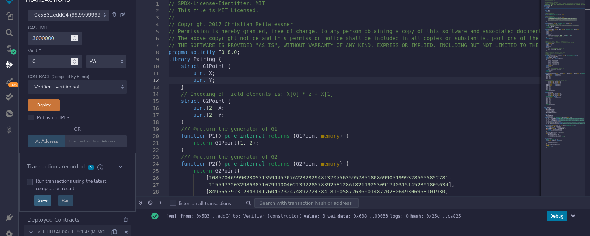

6. Verify the proof.

    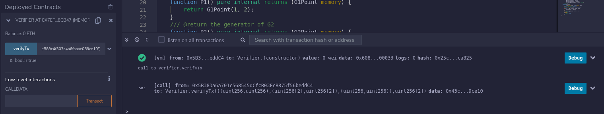

### Q4: how could you use ZoKrates to verify that a certain address on Ethereum has more than say 1 ETH ?

We will probably need a bridge which enables data flow from layer 1 to layer 2.
